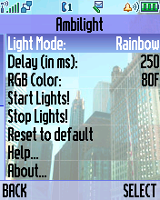
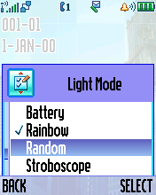
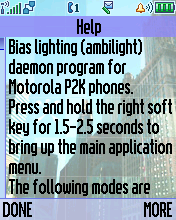
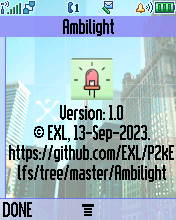
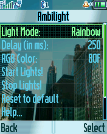
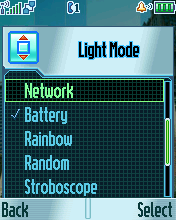
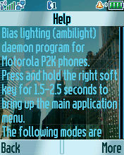
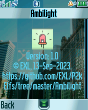

Ambilight
=========

The "Ambilight" ELF daemon utility with GUI settings for some funlights and bias lighting functionality.

## Screenshots from Motorola V600

   

## Screenshots from Motorola ROKR E1

   

## ELF files

* VibroHaptic.elf (ELF for ElfPack 1.0)
* VibroHaptic_V600.elf (ELF for ElfPack 1.0, Motorola V600 version)

## Additional information

The ELF-application has been tested on the following phones and firmware:

* Motorola ROKR E1: R373_G_0E.30.49R
* Motorola V600: TRIPLETS_G_0B.09.72R

Application type: Deamon + GUI + ATI + Funlights.
