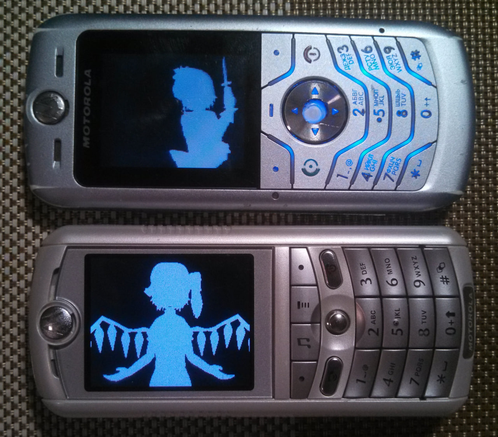

Bad Apple
=========

The implementation of the popular "Bad Apple" demo for the Motorola P2K platform encoded as 1bpp compressed frames.

## Screenshots from Motorola SLVR L6

  

## Screenshots from Motorola ROKR E1

  

## Photos of Motorola SLVR L6 and Motorola ROKR E1

## Videos

See [Bad Apple!! demo on Motorola E398/ROKR E1 and other P2K phones](https://youtu.be/wfju_z-Gamk) video on YouTube.

## Key controls

* Left Soft Key, End Key, 0 - Quit.

## ELF files

| Phone    | Screen  | Viewport        | Fixed FPS  | FPS (avg, min-max) | ELF filename |
|----------|---------|-----------------|------------|--------------------|--------------|
| SLVR L6i | 128x160 | 128x160 (1bpp)  | 30.0       | 31.47, 18.8-55.5   | BadApple.elf |
| ROKR E1  | 176x220 | 176x220 (1bpp)  | 30.0       | 29.60, 13.8-52.6   | BadApple.elf |

* BadApple.elf (ELF for ElfPack 1.0)
* BadApple_V600.elf (ELF for ElfPack 1.0, Motorola V600 version)
* BadApple_60fps.elf (ELF for ElfPack 1.0, experimental 60 FPS version)

## Additional information

The ELF-application has been tested on the following phones and firmware:

* Motorola SLVR L6i: R3443H1_G_0A.65.0BR
* Motorola ROKR E1: R373_G_0E.30.49R
* Motorola V600: TRIPLETS_G_0B.09.72R
* Motorola V235: R3512_G_0A.30.6CR

Application type: GUI + ATI + zlib.

## Useful links

* https://habr.com/ru/articles/645085/
* https://en.wikipedia.org/wiki/Bad_Apple!!#Use_as_a_graphical_and_audio_test
