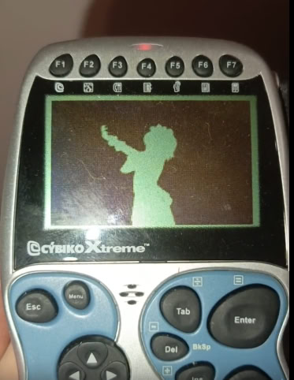

Bad Apple for Cybiko
====================

Just a Bad Apple demo for Cybiko!



Press the \<ESC\> key to exit.

See additional information in the [2048/2048-CyOS](https://github.com/EXL/2048/tree/master/2048-CyOS) repository.

## Creation of "BadApple.fbm" recipe

```bash
# Download original "Bad Apple!!" video from YouTube.
yt-dlp "https://youtu.be/FtutLA63Cp8" -o BadApple.webm

# Set 15 FPS instead of 30 FPS.
ffmpeg -i BadApple.webm -vf "fps=15" BadApple_15f.webm

# Scale it to proper resolution without aspect ratio savings.
ffmpeg -i BadApple_15f.webm -vf "scale=160:100" BadApple_15f_160p.webm
ffmpeg -i BadApple_15f.webm -vf "scale=160:100" -ss "00:00:40.00" -to "00:00:56.00" BadApple_15f_160p.webm

# Unpack raw bitmap frames.
mkdir frames
ffmpeg -i BadApple_15f_160p.webm 'frames/%04d.bmp'

# Convert frames from 24bpp to 2bpp using ImageMagick convert tool.
mkdir bw
cd frames
find * -name '*.bmp' -exec bash -c 'echo "24bpp => 2bpp: {}..." && convert {} -depth 2 ../bw/bw_{}.png' \;

# Create compressed FBM file from frames.
cd ..
./bmp2fbm.py bw
```

## Download

* https://firmware.center/projects/EXL/Cybiko/
