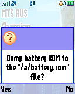
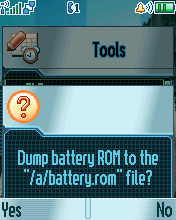
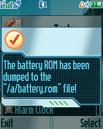

Batt Dump
=========

The "Batt Dump" ELF utility for dumping battery ROM by 1-Wire interface.

## Screenshots from Motorola SLVR L6

## Screenshots from Motorola ROKR E1

 

## ELF files

* BattDump.elf (ELF for ElfPack 1.0)

## Additional information

The ELF-application has been tested on the following phones and firmware:

* Motorola SLVR L6: R3443H1_G_0A.65.0BR
* Motorola ROKR E1: R373_G_0E.30.49R

Application type: GUI.
