Benchmark
=========

A simple ELF benchmarking application for Motorola P2K phones.

## Screenshots from Motorola SLVR L6

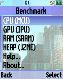 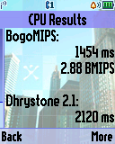 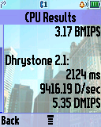 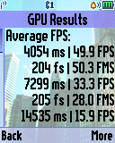

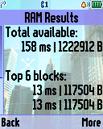 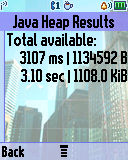  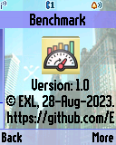

## Screenshots from Motorola V600

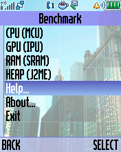 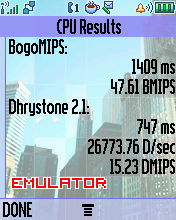 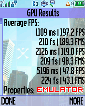 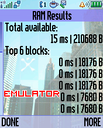

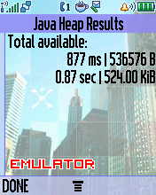 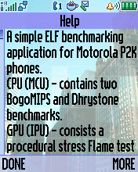 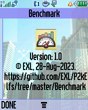

## Screenshots from Motorola ROKR E1

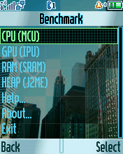 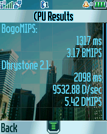 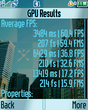 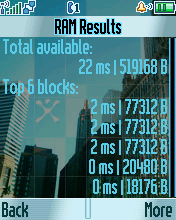

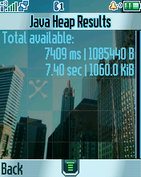 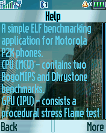 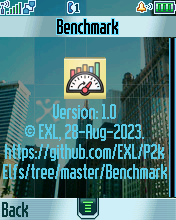

## Videos of benchmarking Motorola phones

See [Overclocking and Benchmakring old Motorola P2K phones (52 MHz to 65 MHz)](https://youtu.be/IO8aktssBo8) video on YouTube.

## Benchmarking results

| Phone    | Set   | Elf | CPU (MCU)                                                  | GPU (IPU)                                                                              | RAM (SRAM)                                           | HEAP (J2ME)                | S/W & H/W                                                                                                                                                                                                                 |
|----------|-------|-----|------------------------------------------------------------|----------------------------------------------------------------------------------------|------------------------------------------------------|----------------------------|---------------------------------------------------------------------------------------------------------------------------------------------------------------------------------------------------------------------------|
| SLVR L6i | thumb | EP1 | 1318 ms   3.17 BMIPS   2124 ms   5.35 DMIPS | 3919 ms   52.6 FPS   7301 ms   33.5 FPS   14380 ms   16.4 FPS | 159 ms   1227520 B   13 ms   117504 B | 4.11 sec   1112.0 KiB | R3443H1_0BR   128x160 cSTN @ 51 Hz @ RGB565   ATI Imageon W2240   T: 196608, I: 196608, E: 0   I: 41280, E: 0, S: 0   Neptune LTE @ 52 MHz   8 MB RAM, 256 KB iRAM, 32 MB ROM               |
| SLVR L6i | arm   | EP1 | 1311 ms   3.19 BMIPS   3036 ms   3.74 DMIPS | 5185 ms   43.8 FPS   7671 ms   29.9 FPS   18552 ms   13.6 FPS | 168 ms   1227520 B   13 ms   117504 B | 4.22 sec   1112.0 KiB | R3443H1_0BR   128x160 cSTN @ 51 Hz @ RGB565   ATI Imageon W2240   T: 196608 @ I: 196608 @ E: 0   I: 41280 @ E: 0, S: 0   Neptune LTE @ 52 MHz   8 MB RAM, 256 KB iRAM, 32 MB ROM            |
| ROKR E1  | thumb | EP1 | 1317 ms   3.17 BMIPS   2094 ms   5.43 DMIPS | 3425 ms   62.5 FPS   6279 ms   39.5 FPS   13635 ms   17.7 FPS | 22 ms   524800 B   2 ms   77312 B     | 7.39 sec   1060.0 KiB | R373_49R   176x220 TFT @ 60 Hz @ RGB565   ATI Imageon W2250   T: 196608, I: 196608, E: 0   I: 3320, E: 0, S: 0   Neptune LTE @ 52 MHz   8 MB RAM, 256 KB iRAM, 32 MB ROM                    |
| ROKR E1  | arm   | EP1 | 1318 ms   3.17 BMIPS   3020 ms   3.76 DMIPS | 4895 ms   52.3 FPS   7744 ms   31.5 FPS   17113 ms   14.8 FPS | 27 ms   526336 B   3 ms   77312 B     | 7.46 sec   1060.0 KiB | R373_49R   176x220 TFT @ 60 Hz @ RGB565   ATI Imageon W2250   T: 196608, I: 196608, E: 0   I: 3320, E: 0, S: 0   Neptune LTE @ 52 MHz   8 MB RAM, 256 KB iRAM, 32 MB ROM                    |
| ROKR E1  | thumb | EP2 | 1300 ms   3.21 BMIPS   1812 ms   6.28 DMIPS | 3332 ms   62.5 FPS   6246 ms   39.5 FPS   12720 ms   18.4 FPS | 29 ms   433920 B   2 ms   77312 B     | 6.95 sec   1060.0 KiB | R373_49R   176x220 TFT @ 60 Hz @ RGB565   ATI Imageon W2250   T: 196608, I: 196608, E: 0   I: 3320, E: 0, S: 0   Neptune LTE @ 52 MHz   8 MB RAM, 256 KB iRAM, 32 MB ROM                    |
| SLVR L7  | thumb | EP1 | 1304 ms   3.21 BMIPS   1909 ms   5.96 DMIPS | 3316 ms   62.5 FPS   6365 ms   39.6 FPS   13239 ms   17.1 FPS | 38 ms   514048 B   4 ms   77312 B     | 1.56 sec   296.0 KiB  | R4513_E0R_RB   176x220 TFT @ 60 Hz @ RGB565   ATI Imageon W2240   T: 196608, I: 196608, E: 0   I: 4928, E: 0, S: 0   Neptune LTE2 @ 52 MHz   8 MB RAM, 512 KB iRAM, 32 MB ROM               |
| V360     | thumb | EP1 | 1304 ms   3.21 BMIPS   1915 ms   5.94 DMIPS | 3506 ms   57.3 FPS   6364 ms   39.5 FPS   13704 ms   17.2 FPS | 36 ms   474624 B   4 ms   77312 B     | 1.83 sec   656.0 KiB  | R4513_ACR   176x220 TFT @ 60 Hz @ RGB565   ATI Imageon W2240   T: 196608, I: 196608, E: 0   I: 4929, E: 0, SYSB: 0   Neptune LTE2 @ 52 MHz   8 MB RAM, 512 KB iRAM, 32 MB ROM               |
| SLVR L7e | thumb | EP1 | ? ms   ? ms   926 ms   12.29 DMIPS          | 3309 ms   62.5 FPS   6022 ms   39.5 FPS   9554 ms   23.2 FPS  | 89 ms   3359232 B   5 ms   230144 B   | 6.95 sec   1172.0 KiB | R452D_0AR   176x220 TFT @ 60 Hz @ RGB565   ATI Imageon W2282   T: 2293760, I: 196608, E: 2097152   I: 42112, E: 1009152, S: 0   Neptune LTE2 @ 52? MHz   16 MB RAM, 512 KB iRAM, 64 MB ROM  |
| KRZR K1  | thumb | EP1 | ? ms   ? ms   941 ms   12.09 DMIPS          | 2209 ms   88.5 FPS   4321 ms   51.9 FPS   9180 ms   24.5 FPS  | 111 ms   2231808 B   5 ms   127744 B  | 4.09 sec   952.0 KiB  | R452F_08R   176x220 TFT @ 90 Hz @ RGB565   ATI Imageon W2282   T: 2293760, I: 196608, E: 2097152   I: 42112, E: 1009152, S: 0   Neptune LTE2 @ 52? MHz   16 MB RAM, 512 KB iRAM, 64 MB ROM  |
| RIZR Z3  | thumb | EP1 | ? ms   ? ms   926 ms   12.29 DMIPS          | 3333 ms   62.5 FPS   6012 ms   39.5 FPS   9674 ms   23.1 FPS  | ? ms   ? B   ? ms   ? B               | ? sec   ? KiB         | R452F1_09R   176x220 TFT @ 60 Hz @ RGB565   ATI Imageon W2282   T: 2293760, I: 196608, E: 2097152   I: 42112, E: 1009152, S: 0   Neptune LTE2 @ 52? MHz   16 MB RAM, 512 KB iRAM, 64 MB ROM |
| RAZR V3i | thumb | EP1 | 1313 ms   3.17 BMIPS   1929 ms   5.90 DMIPS | 3947 ms   55.5 FPS   6888 ms   35.1 FPS   13768 ms   15.9 FPS | 71 ms   1091584 B   5 ms   112384 B   | 5.44 sec   1192.0 KiB | R4441D_03R   176x220 TFT @ 81 Hz @ RGB565   ATI Imageon W2262   T: 2490368, I: 393216, E: 2097152   I: 141888, E: 1009856, S: 0   Neptune LTE2 @ 52 MHz   8 MB RAM, 512 KB iRAM, 48 MB ROM  |
| RAZR V3r | thumb | EP1 | 1304 ms   3.21 BMIPS   1914 ms   5.94 DMIPS | 4461 ms   51.5 FPS   6054 ms   42.5 FPS   13234 ms   19.0 FPS | 28 ms   385280 B   4 ms   77312 B     | 5.21 sec   1280.0 KiB | R4515_D3R   176x220 TFT @ 81 Hz @ RGB565   ATI Imageon W2250   T: 196608, I: 196608, E: 0   I: 4608, E: 0, S: 0   Neptune LTE2 @ 52 MHz   8 MB RAM, 512 KB iRAM, 32 MB ROM                  |
| V300     | thumb | EP1 | 1347 ms   3.11 BMIPS   1971 ms   5.77 DMIPS | 2668 ms   77.2 FPS   4950 ms   50.0 FPS   11888 ms   20.5 FPS | 43 ms   224000 B   2 ms   18176 B     | 1.07 sec   544.0 KiB  | TRIPLETS_72R   176x220 TFT @ 60 Hz @ RGB565   ATI Imageon W2250   T: 196608, I: 196608, E: 0   I: 4600, E: 0, S: 0   Neptune LTE @ 52 MHz   4 MB RAM, 256 KB iRAM, 32 MB ROM                |
| V600     | thumb | EP1 | 1334 ms   3.12 BMIPS   1965 ms   5.79 DMIPS | 2640 ms   82.3 FPS   4922 ms   49.9 FPS   12073 ms   20.1 FPS | 43 ms   224000 B   2 ms   18176 B     | 1.28 sec   524.0 KiB  | TRIPLETS_72R   176x220 TFT @ 60 Hz @ RGB565   ATI Imageon W2250   T: 196608, I: 196608, E: 0   I: 4600, E: 0, S: 0   Neptune LTE @ 52 MHz   4 MB RAM, 256 KB iRAM, 32 MB ROM                |

See [Overclock](../Overclock) project documents for overclocking Benchmark comparision.

### Disks/Volumes benchmarking results

Thanks to @fkcoder, @baat, and @Unreal_man for the tests.

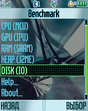 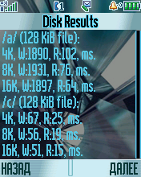

| Phone             | /a/   Intel FDI    128 KiB File                                             | /c/   Intel MMM   128 KiB File                                         | /b/   FAT   128 KiB File                                                  |
|-------------------|---------------------------------------------------------------------------------------|----------------------------------------------------------------------------------|-------------------------------------------------------------------------------------|
| SLVR L6i          | 4K, W:4318, R:162, ms.   8K, W:3935, R:129, ms.   16K, W:3568, R:107, ms.   | 4K, W:445, R:39, ms.   8K, W:420, R:26, ms.   16K, W:405, R:20, ms.    | (None)                                                                              |
| ROKR E1           | 4K, W:4662, R:152, ms.   8K, W:4138, R:107, ms.   16K, W:3765, R:100, ms.   | 4K, W:795, R:38, ms.   8K, W:767, R:26, ms.   16K, W:758, R:20, ms.    | 4K, W:511, R:758, ms.   8K, W:500, R:628, ms.   16K, W:421, R:560, ms.    |
| SLVR L7           | 4K, W:4886, R:161, ms.   8K, W:4618, R:123, ms.   16K, W:4315, R:100, ms.   | 4K, W:974, R:35, ms.   8K, W:959, R:25, ms.   16K, W:938, R:19, ms.    | 4K, W:308, R:190, ms.   8K, W:232, R:168, ms.   16K, W:320, R:159, ms.    |
| SLVR L7e          | 4K, W:3815, R:147, ms.   8K, W:3473, R:115, ms.   16K, W:3138, R:98, ms.    | 4K, W:843, R:38, ms.   8K, W:822, R:26, ms.   16K, W:807, R:19, ms.    | 4K, W:302, R:266, ms.   8K, W:183, R:200, ms.   16K, W:117, R:157, ms.    |
| V300              | 4K, W:8066, R:170, ms.   8K, W:6093, R:129, ms.   16K, W:5739, R:114, ms.   | (None)                                                                           | (None)                                                                              |
| V600              | 4K, W:8152, R:174, ms.   8K, W:6078, R:134, ms.   16K, W:5804, R:115, ms.   | (None)                                                                           | (None)                                                                              |
| V600 (65 MHz)     | 4K, W:6010, R:131, ms.   8K, W:6188, R:102, ms.   16K, W:5289, R:86, ms.    | (None)                                                                           | (None)                                                                              |

Benchmarking results on Motorola ROKR E1 with custom [Dream A Reality 2.x Test 16](https://forum.motofan.ru/index.php?showtopic=167677) firmware: 52 MHz vs. 65 MHz MCU overclock.

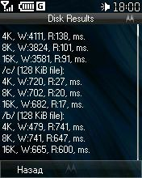 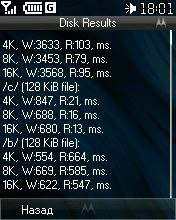

## Other versions

* Various signal e.g. vibromotor finding version using binary search. See [misc/VibroSignal](misc/VibroSignal) utility project in this directory.
* Some deprecated overclocking MCU hacks. See [misc/OverclockCpu](misc/OverclockCpu) utility project in this directory.
* Strange reboot case for Motorola SLVR L7e by pressing "5" button. See [misc/DebugL7e](misc/DebugL7e) utility project in this directory.

## ELF files

* Benchmark.elf (ELF for ElfPack 1.0, thumb)
* Benchmark_arm.elf (ELF for ElfPack 1.0, arm)
* Benchmark_EP2.elf (ELF for ElfPack 2.0, thumb)
* Benchmark_EM1.elf (ELF for ElfPack 1.0, M·CORE)
* Benchmark_EM2.elf (ELF for ElfPack 2.0, M·CORE)
* Benchmark_L7e.elf (ELF for ElfPack 1.0, thumb, Motorola SLVR L7e version)
* Benchmark_V600.elf (ELF for ElfPack 1.0, thumb, Motorola V600, version)
* VibroSignal.elf (ELF for ElfPack 1.0)
* OverclockCpu.elf (ELF for ElfPack 1.0)
* DebugL7e.elf (ELF for ElfPack 1.0)

## Additional information

The ELF-application has been tested on the following phones and firmware:

* Motorola SLVR L6: R3511_G_0A.52.45R_A
* Motorola SLVR L6i: R3443H1_G_0A.65.0BR
* Motorola ROKR E1: R373_G_0E.30.49R
* Motorola V360: R4513_G_08.B7.ACR
* Motorola SLVR L7: R4513_G_08.B7.E0R_RB
* Motorola SLVR L7e: R452D_G_08.01.0AR (some bugs)
* Motorola KRZR K1: R452F_G_08.03.08R (some bugs)
* Motorola RIZR Z3: R452F1_G_08.04.09R (some bugs)
* Motorola RAZR V3i: R4441D_G_08.01.03R
* Motorola RAZR V3r: R4515_G_08.BD.D3R

Application type: GUI + ATI + Java Heap.
