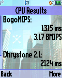

Benchmark
=========

A simple ELF benchmarking application for Motorola P2K phones.

## Screenshots from Motorola SLVR L6

     

## Screenshots from Motorola ROKR E1

    

## Videos of benchmarking Motorola phones

See [Benchmark ELF on Motorola P2K phones](https://www.youtube.com/TODO) video on YouTube.

## Benchmarking results

| Phone    | Set    | Elf | CPU (MCU)                                      | GPU (IPU)                                                            | RAM (SRAM)                               | HEAP (J2ME)          | S/W & H/W                                                                                                                                                     |
| ---      | ---    | --- | ---                                            | ---                                                                  | ---                                      | ---                  | ---                                                                                                                                                           |
| SLVR L6i | thumb  | EP1 | 1463 ms, 2.85 BMIPS   2132 ms, 5.33 DMIPS | 3919 ms, 52.6 FPS   7301 ms, 33.5 FPS   14380 ms, 16.4 FPS | 159 ms, 1227520 B   13 ms, 117504 B | 4.11 sec, 1112.0 KiB | R3511_45R_A   128x160 cSTN @ 51 Hz @ RGB565   ATI Imageon W2240   Neptune LTE @ 52 MHz   8 MB RAM   256 KB iRAM   32 MB ROM     |
| SLVR L6i | arm    | EP1 | 1466 ms, 1.42 BMIPS   3048 ms, 3.73 DMIPS | 5185 ms, 43.8 FPS   7671 ms, 29.9 FPS   18552 ms, 13.6 FPS | 168 ms, 1227520 B   13 ms, 117504 B | 4.22 sec, 1112.0 KiB | R3511_45R_A   128x160 cSTN @ 51 Hz @ RGB565   ATI Imageon W2240   Neptune LTE @ 52 MHz   8 MB RAM   256 KB iRAM   32 MB ROM     |
| ROKR E1  | thumb  | EP1 | 1458 ms, 2.86 BMIPS   2094 ms, 5.43 DMIPS | 3425 ms, 62.5 FPS   6279 ms, 39.5 FPS   13635 ms, 17.7 FPS | 22 ms, 524800 B   2 ms, 77312 B     | 7.39 sec, 1060.0 KiB | R373_49R   176x220 TFT @ 60 Hz @ RGB565   ATI Imageon W2250   Neptune LTE @ 52 MHz   8 MB RAM   256 KB iRAM   32 MB ROM         |
| ROKR E1  | arm    | EP1 | 1458 ms, 1.42 BMIPS   3020 ms, 3.76 DMIPS | 4895 ms, 52.3 FPS   7744 ms, 31.5 FPS   17113 ms, 14.8 FPS | 27 ms, 526336 B   3 ms, 77312 B     | 7.46 sec, 1060.0 KiB | R373_49R   176x220 TFT @ 60 Hz @ RGB565   ATI Imageon W2250   Neptune LTE @ 52 MHz   8 MB RAM   256 KB iRAM   32 MB ROM         |
| ROKR E1  | thumb  | EP2 | 1273 ms, 1.63 BMIPS   1826 ms, 6.23 DMIPS | 3332 ms, 62.5 FPS   6246 ms, 39.5 FPS   12720 ms, 18.4 FPS | 29 ms, 433920 B   2 ms, 77312 B     | 6.95 sec, 1060.0 KiB | R373_49R   176x220 TFT @ 60 Hz @ RGB565   ATI Imageon W2250   Neptune LTE @ 52 MHz   8 MB RAM   256 KB iRAM   32 MB ROM         |
| SLVR L7  | thumb  | EP1 | 1446 ms, 2.88 BMIPS   1917 ms, 5.93 DMIPS | 3316 ms, 62.5 FPS   6365 ms, 39.6 FPS   13239 ms, 17.1 FPS | 38 ms, 514048 B   4 ms, 77312 B     | 1.56 sec, 296.0 KiB  | R4513_E0R_RB   176x220 TFT @ 60 Hz @ RGB565   ATI Imageon W2240   Neptune LTE2 @ 52 MHz   8 MB RAM   512 KB iRAM   32 MB ROM    |
| V360     | thumb  | EP1 | 1444 ms, 2.89 BMIPS   1915 ms, 5.94 DMIPS | 3506 ms, 57.3 FPS   6364 ms, 39.5 FPS   13704 ms, 17.2 FPS | 36 ms, 474624 B   4 ms, 77312 B     | ?, ?                 | R4513_ACR   176x220 TFT @ 60 Hz @ RGB565   ATI Imageon W2240   Neptune LTE2 @ 52 MHz   8 MB RAM   512 KB iRAM   32 MB ROM       |
| SLVR L7e | thumb  | EP1 | ?, ?   926 ms, 12.29 DMIPS                | ?, ?   ?, ?   ?, ?                                         | 89 ms, 3359232 B   5 ms, 230144 B   | 6.95 sec, 1172.0 KiB | R452D_0AR   176x220 TFT @ ? Hz @ ?   ATI Imageon ?   Neptune LTE2 @ 104 (?) MHz   16 MB RAM   512 KB iRAM   64 MB ROM           |

## Other versions

* Various signal e.g. vibromotor finding version using binary search. See [find_vibromotor_signal](https://github.com/EXL/P2kElfs/tree/find_vibromotor_signal) branch in this repository.

## ELF files

* Benchmark_EP1.elf (ELF for ElfPack 1.0, thumb)
* Benchmark_EP1_arm.elf (ELF for ElfPack 1.0, arm)
* Benchmark_EP2.elf (ELF for ElfPack 2.0, thumb)
* Benchmark_EM1.elf (ELF for ElfPack 1.0, M·CORE)
* Benchmark_EM2.elf (ELF for ElfPack 2.0, M·CORE)
* Benchmark_L7e.elf (ELF for ElfPack 1.0, thumb, Motorola SLVR L7e version)
* Benchmark_V600.elf (ELF for ElfPack 1.0, thumb, Motorola V600, version)

## Additional information

The ELF-application has been tested on the following phones and firmware:

* Motorola SLVR L6i: R3443H1_G_0A.65.0BR
* Motorola ROKR E1: R373_G_0E.30.49R
* Motorola V360: R4513_G_08.B7.ACR
* Motorola SLVR L7: R4513_G_08.B7.E0R_RB
* Motorola SLVR L7e: R452D_G_08.01.0AR

Application type: GUI + ATI + Java Heap.
