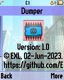

Dumper
======

The "Dumper" ELF utility for dumping various memory regions of Motorola P2K phones.

## Screenshots from Motorola SLVR L6

   

## Screenshots from Motorola V600

  

## Screenshots from Motorola ROKR E1

  

## Additional information

The ELF-application has been tested on the following phones and firmware:

* Motorola SLVR L6: R3443H1_G_0A.65.0BR
* Motorola ROKR E1: R373_G_0E.30.49R
* Motorola V600: TRIPLETS_G_0B.09.72R
* Motorola V360: R4513_G_08.B7.ACR
* Motorola V235: R3512_G_0A.30.6CR

Application type: GUI.
