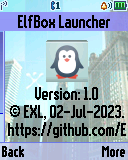
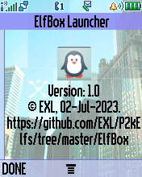
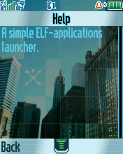

Elf Box
=======

A simple "ElfBox" ELF-applications launcher for Motorola phones.

## Screenshots from Motorola C650

  

## Screenshots from Motorola SLVR L6

  

## Screenshots from Motorola V600

  

## Screenshots from Motorola ROKR E1

    

## ELF files

* ElfBox.elf (ELF for ElfPack 1.0)
* ElfBox_V600.elf (ELF for ElfPack 1.0, Motorola V600 version)
* ElfBox_C650.elf (ELF for ElfPack 1.0, Motorola C650 version)

## Additional information

The ELF-application has been tested on the following phones and firmware:

* Motorola C650: R365_G_0B.D3.08R
* Motorola SLVR L6i: R3443H1_G_0A.65.0BR
* Motorola ROKR E1: R373_G_0E.30.49R
* Motorola V600: TRIPLETS_G_0B.09.72R

Application type: GUI + ElfLoader.
