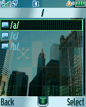

ElfBox
======

A simple "ElfBox" ELF-applications launcher.

## Screenshots from Motorola SLVR L6

  

## Screenshots from Motorola V600

  

## Screenshots from Motorola ROKR E1

   

## Additional information

The ELF-application has been tested on the following phones and firmware:

* Motorola SLVR L6: R3443H1_G_0A.65.0BR
* Motorola ROKR E1: R373_G_0E.30.49R
* Motorola V600: TRIPLETS_G_0B.09.72R

Application type: GUI.
