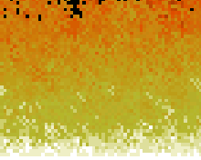
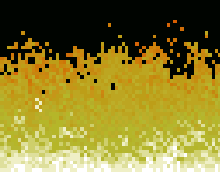
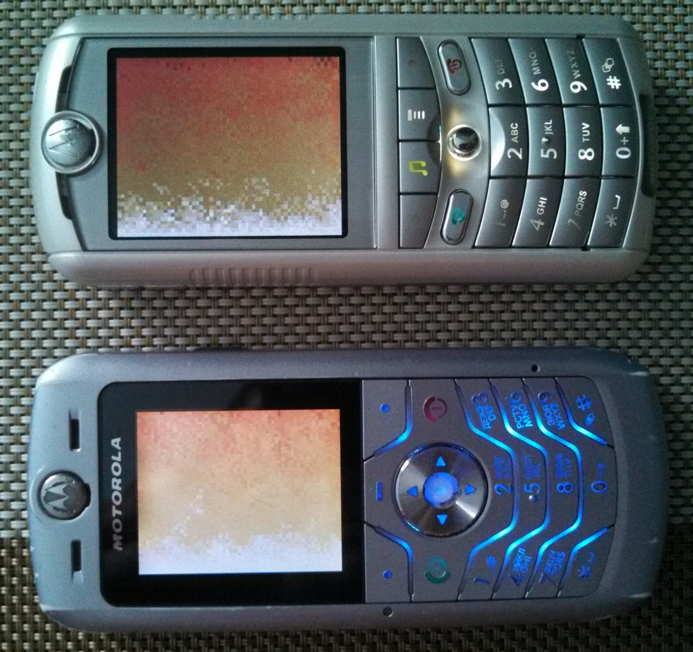

Fire Effect
===========

Port of the Doom PSX fire effect demo splash screen to the Motorola P2K phones platform.

## Screenshots from Motorola SLVR L6

 

## Screenshots from Motorola ROKR E1

 

## Photos of Motorola SLVR L6 and Motorola ROKR E1

## Videos

See [Some ELF demos/games on Motorola P2K phones using ATI Imageon W2240/W2250 videochip
](https://www.youtube.com/watch?v=DsYLWXPgmsU&t=180s) video on YouTube.

## Key controls

* Left Soft Key, End Key, 0 - Quit.

## Other versions

* Simple unfinished black-and-white version. See [fire_effect_bw](https://github.com/EXL/P2kElfs/tree/fire_effect_bw) branch in this repository.

## ELF files

| Phone   | Screen  | Flags | Viewport            | Fixed FPS  | FPS (avg, min-max) | ELF filename   |
| ---     | ---     | ---   | ---                 | ---        | ---                |---             |
| SLVR L6 | 128x160 | ROT90 | 64x48 (rotozoom)    | 30.0       | 15.94, 12.8-22.7   | FireEffect.elf |
| ROKR E1 | 176x220 | ROT90 | 64x48 (rotozoom)    | 30.0       | 18.29, 15.1-30.3   | FireEffect.elf |

* FireEffect.elf (ELF for ElfPack 1.0)
* FireEffect_BW.elf (ELF for ElfPack 1.0, Black & White version)
* FireEffect_V600.elf (ELF for ElfPack 1.0, Motorola V600 version)
* FireEffect_EP2.elf (ELF for ElfPack 2.0)

## Additional information

The ELF-application has been tested on the following phones and firmware:

* Motorola SLVR L6: R3443H1_G_0A.65.0BR
* Motorola ROKR E1: R373_G_0E.30.49R
* Motorola V600: TRIPLETS_G_0B.09.72R
* Motorola V360: R4513_G_08.B7.ACR
* Motorola V235: R3512_G_0A.30.6CR
* Motorola SLVR L7: R4513_G_08.B7.E0R_RB

Application type: GUI + ATI.

## Useful links

* https://fabiensanglard.net/doom_fire_psx
* https://github.com/EXL/Stuff/tree/master/Sandbox/SDL/doom_fire_demo
