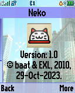
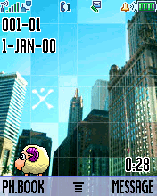
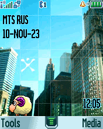

Neko
====

Fun animated widget for desktop screen with skin support.

## Screenshots from Motorola SLVR L6

   

   

## Screenshots from Motorola V600

   

   

## Screenshots from Motorola ROKR E1

   

   

## Videos of Motorola ROKR E1 and Motorola SLVR L6

See [Neko Widget ELF application for Motorola P2K phones](TODO) video on YouTube.

## Skins

ANI skin files should be located next to the `Neko.elf` application. List of the default ANI-skins:

1. Neco-Arc.
2. Kitty.
3. Sheep.
4. PepeD.

Additional information about creating and editing ANI-skins see [here](skin).

## ELF files

* Neko.elf (ELF for ElfPack 1.0)
* Neko_V600.elf (ELF for ElfPack 1.0, Motorola V600 version)

## Additional information

The ELF-application has been tested on the following phones and firmware:

* Motorola SLVR L6i: R3443H1_G_0A.65.0BR
* Motorola ROKR E1: R373_G_0E.30.49R

Application type: Deamon + GUI + ATI + Widgets.
