Overclock
=========

An application for overclocking ARM7TDMI core in Neptune SoC phones from stock 52 MHz to 65 MHz.

## Screenshots from Motorola SLVR L6

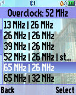 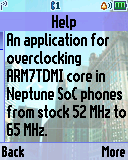 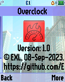

## Screenshots from Motorola ROKR E1

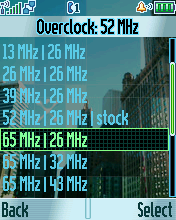  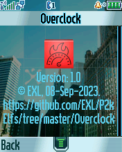

## Videos of benchmarking Motorola phones

See [Overclocking and Benchmakring old Motorola P2K phones (52 MHz to 65 MHz)](https://youtu.be/IO8aktssBo8) video on YouTube.

## Overclocking results

### 52 MHz

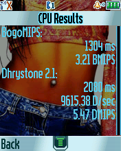  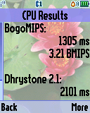 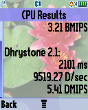   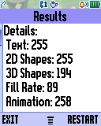

### 65 MHz

 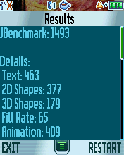 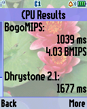 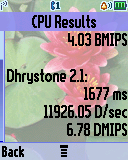  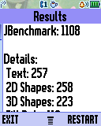 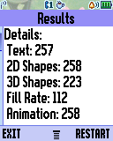

### Benchmark table

| Phone    | Freq   | CPU (MCU)                                                  | GPU (IPU)                                                                              | RAM (SRAM)                                           | HEAP (J2ME)                |
| ---      | ---    | ---                                                        | ---                                                                                    | ---                                                  | ---                        |
| SLVR L6i | 52 MHz | 1305 ms   3.21 BMIPS   2101 ms   5.41 DMIPS | 3919 ms   52.6 FPS   7301 ms   33.5 FPS   14380 ms   16.4 FPS | 159 ms   1227520 B   13 ms   117504 B | 4.11 sec   1112.0 KiB |
| SLVR L6i | 65 MHz | 1039 ms   4.03 BMIPS   1677 ms   6.78 DMIPS | 3900 ms   52.6 FPS   7015 ms   33.8 FPS   11442 ms   20.2 FPS | 125 ms   1222912 B   10 ms   117504 B | 2.34 sec   1164.0 KiB |
| ROKR E1  | 52 MHz | 1304 ms   3.21 BMIPS   2080 ms   5.47 DMIPS | 3425 ms   62.5 FPS   6279 ms   39.5 FPS   13635 ms   17.7 FPS | 22 ms   524800 B   2 ms   77312 B     | 7.39 sec   1060.0 KiB |
| ROKR E1  | 65 MHz | 1039 ms   4.03 BMIPS   1653 ms   6.88 DMIPS | 3454 ms   62.5 FPS   5986 ms   39.5 FPS   11079 ms   21.6 FPS | 18 ms   526336 B   2 ms   77312 B     | 5.44 sec   1060.0 KiB |
| SLVR L7  | 52 MHz | 1304 ms   3.21 BMIPS   1909 ms   5.96 DMIPS | ?   ?   ?   ?   ?   ?                                         | ?   ?   ?   ?                         | ?   ?                 |
| SLVR L7  | 65 MHz | 1043 ms   4.01 BMIPS   1528 ms   7.44 DMIPS | ?   ?   ?   ?   ?   ?                                         | ?   ?   ?   ?                         | ?   ?                 |
| V360     | 52 MHz | 1304 ms   3.21 BMIPS   1922 ms   5.92 DMIPS | ?   ?   ?   ?   ?   ?                                         | ?   ?   ?   ?                         | ?   ?                 |
| V360     | 65 MHz | 1035 ms   4.04 BMIPS   1524 ms   7.46 DMIPS | ?   ?   ?   ?   ?   ?                                         | ?   ?   ?   ?                         | ?   ?                 |
| RAZR V3i | 52 MHz | 1313 ms   3.17 BMIPS   1929 ms   5.90 DMIPS | 3947 ms   55.5 FPS   6888 ms   35.1 FPS   13768 ms   15.9 FPS | 71 ms   1091584 B   5 ms   112384 B   | 5.44 sec   1192.0 KiB |
| RAZR V3i | 65 MHz | 1067 ms   3.91 BMIPS   1563 ms   7.28 DMIPS | 3905 ms   55.5 FPS   6688 ms   35.1 FPS   10763 ms   22.7 FPS | 46 ms   960512 B   4 ms   112384 B    | ?   ?                 |

See [Benchmark](../Benchmark) project documents for more stock results.

### Yeti3D table

| Phone    | Freq   | Screen  | Flags | Viewport   Mode       | Optimized | FPS   (avg, min-max) | ELF filename          |
| ---      | ---    | ---     | ---   | ---                        | ---       | ---                       | ---                   |
| SLVR L6i | 52 MHz | 128x160 | ROT0  | 160x128   fullscreen  | No        | 5.58   5.4-5.7       | Y3D_VN1F_160x128.elf  |
| SLVR L6i | 65 MHz | 128x160 | ROT0  | 160x128   fullscreen  | No        | 7.38   5.1-8.5       | Y3D_VN1F_160x128.elf  |
| SLVR L6i | 52 MHz | 128x160 | ROT0  | 160x128   fullscreen  | Yes       | 5.64   5.5-5.7       | Y3D_VO1F_160x128.elf  |
| SLVR L6i | 65 MHz | 128x160 | ROT0  | 160x128   fullscreen  | Yes       | 7.30   5.3-8.3       | Y3D_VO1F_160x128.elf  |
| SLVR L6i | 52 MHz | 128x160 | ROT90 | 120x80   rotozoom     | No        | 8.20   7.8-8.5       | Y3D_RN1F_120x80.elf   |
| SLVR L6i | 65 MHz | 128x160 | ROT90 | 120x80   rotozoom     | No        | 10.38   9.3-11.1     | Y3D_RN1F_120x80.elf   |
| SLVR L6i | 52 MHz | 128x160 | ROT90 | 120x80   rotozoom     | Yes       | 8.23   7.8-8.6       | Y3D_RO1F_120x80.elf   |
| SLVR L6i | 65 MHz | 128x160 | ROT90 | 120x80   rotozoom     | Yes       | 10.47   9.4-12.9     | Y3D_RO1F_120x80.elf   |
| SLVR L6i | 52 MHz | 128x160 | ROT90 | 96x64   rotozoom      | No        | 10.15   9.9-10.4     | Y3D_RN1F_96x64.elf    |
| SLVR L6i | 65 MHz | 128x160 | ROT90 | 96x64   rotozoom      | No        | 11.74   10.5-14.2    | Y3D_RN1F_96x64.elf    |
| SLVR L6i | 52 MHz | 128x160 | ROT90 | 96x64   rotozoom      | Yes       | 10.18   9.3-10.5     | Y3D_RO1F_96x64.elf    |
| SLVR L6i | 65 MHz | 128x160 | ROT90 | 96x64   rotozoom      | Yes       | 12.90   10.3-15.8    | Y3D_RO1F_96x64.elf    |
| ROKR E1  | 52 MHz | 176x220 | ROT0  | 220x176   fullscreen  | No        | 3.74   3.4-4.0       | Y3D_VN1F_220x176.elf  |
| ROKR E1  | 65 MHz | 176x220 | ROT0  | 220x176   fullscreen  | No        | 5.24   5.0-5.4       | Y3D_VN1F_220x176.elf  |
| ROKR E1  | 52 MHz | 176x220 | ROT0  | 220x176   fullscreen  | Yes       | 3.91   3.7-4.0       | Y3D_VO1F_220x176.elf  |
| ROKR E1  | 65 MHz | 176x220 | ROT0  | 220x176   fullscreen  | Yes       | 5.34   5.0-5.4       | Y3D_VO1F_220x176.elf  |
| ROKR E1  | 52 MHz | 176x220 | ROT90 | 120x80   rotozoom     | No        | 8.40   7.4-8.6       | Y3D_RN1F_120x80.elf   |
| ROKR E1  | 65 MHz | 176x220 | ROT90 | 120x80   rotozoom     | No        | 12.00   11.9-12.1    | Y3D_RN1F_120x80.elf   |
| ROKR E1  | 52 MHz | 176x220 | ROT90 | 120x80   rotozoom     | Yes       | 8.40   7.0-8.6       | Y3D_RO1F_120x80.elf   |
| ROKR E1  | 65 MHz | 176x220 | ROT90 | 120x80   rotozoom     | Yes       | 12.09   9.8-15.1     | Y3D_RO1F_120x80.elf   |
| ROKR E1  | 52 MHz | 176x220 | ROT90 | 96x64   rotozoom      | No        | 9.90   8.5-10.1      | Y3D_RN1F_96x64.elf    |
| ROKR E1  | 65 MHz | 176x220 | ROT90 | 96x64   rotozoom      | No        | 14.75   12.9-15.1    | Y3D_RN1F_96x64.elf    |
| ROKR E1  | 52 MHz | 176x220 | ROT90 | 96x64   rotozoom      | Yes       | 11.15   8.6-12.0     | Y3D_RO1F_96x64.elf    |
| ROKR E1  | 65 MHz | 176x220 | ROT90 | 96x64   rotozoom      | Yes       | 19.92   15.3-20.4    | Y3D_RO1F_96x64.elf    |

See [Yeti3D](../Yeti3D) project documents for more stock results.

## ELF files

* Overclock.elf (ELF for ElfPack 1.0)
* Overclock_L7e.elf (ELF for ElfPack 1.0, Motorola SLVR L7e and Motorola V360 version)
* Overclock_V600.elf (ELF for ElfPack 1.0, Motorola V600 version)

## Additional information

The ELF-application has been tested on the following phones and firmware:

* Motorola SLVR L6i: R3443H1_G_0A.65.0BR
* Motorola ROKR E1: R373_G_0E.30.49R
* Motorola V360: R4513_G_08.B7.ACR
* Motorola SLVR L7: R4513_G_08.B7.E0R_RB
* Motorola SLVR L7e: R452D_G_08.01.0AR (not working)
* Motorola KRZR K1:  R452F_G_08.03.08R (not working)

Application type: GUI.

Please read the [Overclocking MCU in Motorola E398 and similar phones](https://forum.motofan.ru/index.php?showtopic=1742268) topic on MotoFan.Ru forum for additional information (in Russian).
