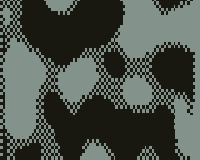
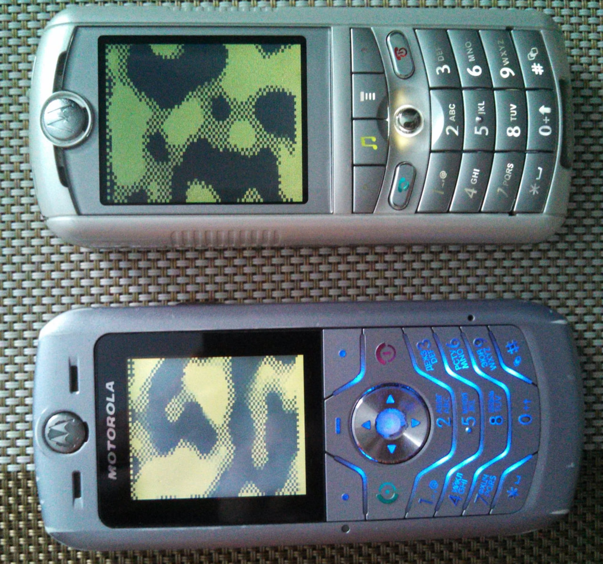

Perlin
======

Port of the "Perlin" plasma and fire demo by [@BOOtak](https://github.com/BOOtak) (Kirill Leyfer) from DCT-3 platform (Nokia 3310) to the Motorola P2K phones platform.

## Screenshots from Motorola SLVR L6

  

## Screenshots from Motorola ROKR E1

  

## Photos

## Videos

See [Some ELF demos/games on Motorola P2K phones using ATI Imageon W2240/W2250 videochip
](https://www.youtube.com/watch?v=DsYLWXPgmsU&t=110s) video on YouTube.

## Web Demo

* [Perlin Web](https://lab.exlmoto.ru/perlin/) page.
* [Perlin Web](https://exlmotodev.github.io/perlin/) mirror page.
* [Snake Pit Web](https://lab.exlmoto.ru/snake_pit/) page.
* [Snake Pit Web](https://exlmotodev.github.io/snake_pit/) mirror page.

## Key controls

* 1, 2, 3 - Change palette.
* 5 - Enable or disable fire demo (slow!).
* Left Soft Key, End Key, 0 - Quit.

## ELF files

| Phone   | Screen  | Flags | Viewport            | Demo   | Fixed FPS  | FPS (avg, min-max) | ELF filename |
| ---     | ---     | ---   | ---                 | ---    | ---        | ---                |---           |
| SLVR L6 | 128x160 | ROT90 | 84x48 (rotozoom)    | Plasma | 15.0       | 12.13, 11.4-12.8   | Perlin.elf   |
| ROKR E1 | 176x220 | ROT90 | 84x48 (rotozoom)    | Plasma | 15.0       | 13.72, 12.6-15.1   | Perlin.elf   |
| SLVR L6 | 128x160 | ROT90 | 84x48 (rotozoom)    | Fire   | 15.0       | 1.88, 1.8-1.9      | Perlin.elf   |
| ROKR E1 | 176x220 | ROT90 | 84x48 (rotozoom)    | Fire   | 15.0       | 1.93, 1.7-2.0      | Perlin.elf   |

* Perlin.elf (ELF for ElfPack 1.0)
* Perlin_EP2.elf (ELF for ElfPack 2.0)

## Additional information

The ELF-application has been tested on the following phones and firmware:

* Motorola SLVR L6: R3443H1_G_0A.65.0BR
* Motorola ROKR E1: R373_G_0E.30.49R

Application type: GUI + ATI.

## Useful links

* https://github.com/BOOtak/dct3ngine
* https://www.youtube.com/watch?v=3BKg8yG4fTc
