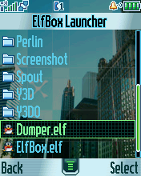

Motorola P2K ELFs
=================

The source code of ELF applications for Motorola phones on the P2K platform.

  

My thread [ELFs by EXL](https://forum.motofan.ru/index.php?showtopic=1742337) with additional information about ELF application development on the MotoFan.Ru forum.

Ready-to-run ELF build are available in the [Release](https://github.com/EXL/P2kElfs/releases) section.

## Projects

1. **[2048-UIS](https://github.com/EXL/2048/tree/master/2048-P2K)**

    The "2048" puzzle game for the Motorola P2K platform written using AFW and UIS frameworks and implemented as ELF-application.\
    Application type: GUI + UIS Canvas.

2. **[2048-AHI](https://github.com/EXL/2048/tree/master/2048-P2K/2048-AHI)**

    A popular "2048" puzzle game for Motorola P2K implemented as ELF-application. Written using AFW/UIS frameworks and AHI (ATI Handheld Interface) video driver.\
    Application type: GUI + UIS Canvas + ATI.

3. **[Ambilight](Ambilight)**

    ELF daemon utility with GUI settings for some funlights and bias lighting functionality.\
    Application type: Deamon + GUI + ATI + Funlights.

4. **[Batt Dump](BattDump)**

    ELF utility for dumping battery ROM by 1-Wire interface.\
    Application type: GUI.

5. **[Benchmark](Benchmark)**

    A simple ELF benchmarking application for Motorola P2K phones.\
    Application type: GUI + ATI + Java Heap.

6. **[Dumper](Dumper)**

    ELF utility for dumping various memory regions of Motorola P2K phones.\
    Application type: GUI.

7. **[Elf Box](ElfBox)**

    A simple "ElfBox" ELF-applications launcher.\
    Application type: GUI + ElfLoader.

8. **[Fire Effect](FireEffect)**

    Port of the Doom PSX fire effect demo splash screen to the Motorola P2K phones platform.\
    Application type: GUI + ATI.

9. **[Neko](Neko)**

    Fun animated widget for desktop screen with skin support.\
    Application type: Deamon + GUI + ATI + Widgets.

10. **[Overclock](Overclock)**

    An application for overclocking ARM7TDMI core in Neptune SoC phones from stock 52 MHz to 65 MHz.\
    Application type: GUI.

11. **[Perlin](Perlin)**

    Port of the "Perlin" plasma and fire demo by [@BOOtak](https://github.com/BOOtak) (Kirill Leyfer) from DCT-3 platform (Nokia 3310) to the Motorola P2K phones platform.\
    Application type: GUI + ATI.

12. **[Power Alert](PowerAlert)**

    ELF example of sending SMS on power loss.\
    Application type: Daemon.

13. **[Screenshot](Screenshot)**

    ELF daemon utility with GUI to fast take screenshots.\
    Application type: GUI + Deamon.

14. **[Spout](Spout)**

    Port of the "Spout" game by kuni to the Motorola P2K phones platform.\
    Application type: GUI + ATI.

15. **[Vibro Haptic](VibroHaptic)**

    ELF daemon utility with GUI settings for vibration feedback like in Sony Ericsson phones.\
    Application type: Deamon + GUI.

16. **[Yeti3D Old](Yeti3D-Old)**

    Port of the "Yeti3D Old" 3D engine demo by **Derek J. Evans** from [Nintendo Game Boy Advance](https://en.wikipedia.org/wiki/Game_Boy_Advance) (GBA) to the Motorola P2K phones platform.\
    Application type: GUI + ATI.

17. **[Yeti3D](Yeti3D)**

    Port of the heavy optimized "Yeti3D" 3D engine demo by **Derek J. Evans** from [Nintendo Game Boy Advance](https://en.wikipedia.org/wiki/Game_Boy_Advance) (GBA) to the Motorola P2K phones platform.\
    Application type: GUI + ATI + Java Heap + Videomode + Tasks (in the Task version).

## Infromation

* [ELFs by EXL](https://forum.motofan.ru/index.php?showtopic=1742337): A thread on the MotoFan.Ru forum with my ELF projects and additional information.
* [ELFs development and porting](https://forum.motofan.ru/index.php?showforum=184): A section of the MotoFan.Ru forum dedicated to the development and porting of ELFs.
* [ElfPack 1.x](https://wiki.motofan.ru/ElfPack): Page on MotoWiki site about first version of ElfPack for Motorola P2K phones.
* [ElfPack 2.x](https://wiki.motofan.ru/ElfPack2): Page on MotoWiki site about second version of ElfPack for Motorola P2K phones.
* [ElfPack 1.x M*CORE](https://forum.motofan.ru/index.php?showtopic=176195): A thread on the MotoFan.Ru forum dedicated to the development and porting of ELFs to M*CORE architecture and Rainbow POG platform (first version).
* [ElfPack 2.x M*CORE](https://forum.motofan.ru/index.php?showtopic=149775): A thread on the MotoFan.Ru forum dedicated to the development and porting of ELFs to M*CORE architecture and Rainbow POG platform (second version).
