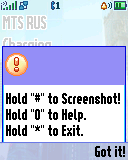
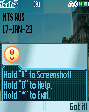

Screenshot
==========

The "Screenshot" ELF daemon utility with GUI to fast take screenshots.

## Screenshots from Motorola SLVR L6

## Screenshots from Motorola V600

## Screenshots from Motorola ROKR E1

## ELF files

* Screenshot.elf (ELF for ElfPack 1.0)
* Screenshot_NP.elf (ELF for ElfPack 1.0, Motorola SLVR L7e, KRZR K1 + NoPacked version)
* Screenshot_V600.elf (ELF for ElfPack 1.0, Motorola V600 + NoPacked version)
* Screenshot_V635.elf (ELF for ElfPack 1.0, Motorola V635 + NoPacked version)
* Screenshot_C650.elf (ELF for ElfPack 1.0, Motorola C650 + NoPacked version)

## Additional information

The ELF-application has been tested on the following phones and firmware:

* Motorola C650: R365_G_0B.D3.08R
* Motorola SLVR L6: R3511_G_0A.52.45R_A
* Motorola SLVR L6i: R3443H1_G_0A.65.0BR
* Motorola ROKR E1: R373_G_0E.30.49R
* Motorola V600: TRIPLETS_G_0B.09.72R
* Motorola V235: R3512_G_0A.30.6CR
* Motorola RAZR V3r: R4515_G_08.BD.D3R
* Motorola SLVR L7e: R452D_G_08.01.0AR
* Motorola KRZR K1:  R452F_G_08.03.08R
* Motorola V635: R474_G_08.48.6FR

Application type: GUI + GPU + Deamon.
