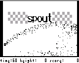
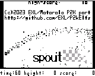
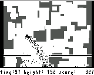
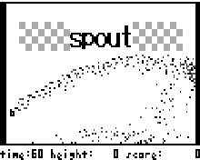
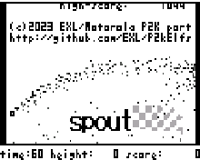
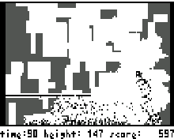
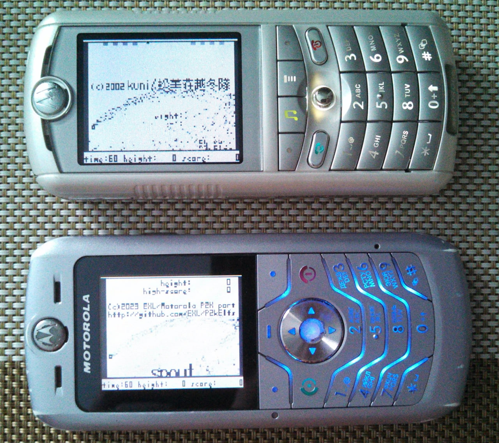

Spout
=====

Port of the "Spout" game by kuni to the Motorola P2K phones platform.

## Screenshots from Motorola SLVR L6

  

## Screenshots from Motorola ROKR E1

  

## Photos

## Videos

See [Some ELF demos/games on Motorola P2K phones using ATI Imageon W2240/W2250 videochip
](https://www.youtube.com/watch?v=DsYLWXPgmsU) video on YouTube.

## Key controls

* D-Pad, 2, 4, 6, 8 - Movement.
* Center, 5 - Fire.
* 3 - Enable autofire.
* Right Soft Key, 9 - Pause.
* Left Soft Key, End Key, 0 - Quit.

## Other versions

* Version with long sight tail. See [spout_feature_long_tail](https://github.com/EXL/P2kElfs/tree/spout_feature_long_tail) branch in this repository.

## ELF files

| Phone   | Screen  | Flags | Viewport            | Fixed FPS  | FPS (avg, min-max) | ELF filename  |
| ---     | ---     | ---   | ---                 | ---        | ---                |---            |
| SLVR L6 | 128x160 | ROT90 | 128x88 (rotozoom)   | 15.0       | 15.38, 14.9-16.9   | Spout_RL1.elf |
| SLVR L6 | 128x160 | ROT0  | 128x88 (original)   | 15.0       | 15.29, 14.7-15.8   | Spout_OL1.elf |
| ROKR E1 | 176x220 | ROT90 | 128x88 (rotozoom)   | 15.0       | 15.20, 15.1-15.3   | Spout_RL1.elf |
| ROKR E1 | 176x220 | ROT0  | 128x88 (original)   | 15.0       | 15.18, 15.1-15.3   | Spout_OL1.elf |
| SLVR L6 | 128x160 | ROT90 | 128x88 (rotozoom)   | 30.0       | 16.80, 16.9-17.2   | Spout_RH1.elf |
| SLVR L6 | 128x160 | ROT0  | 128x88 (original)   | 30.0       | 21.69, 19.6-24.3   | Spout_OH1.elf |
| ROKR E1 | 176x220 | ROT90 | 128x88 (rotozoom)   | 30.0       | 27.91, 19.2-30.3   | Spout_RH1.elf |
| ROKR E1 | 176x220 | ROT0  | 128x88 (original)   | 30.0       | 28.56, 18.8-30.3   | Spout_OH1.elf |

### Legend

* R (1st) - ATI hardware rootation and zoom surface e.g. 128x88 => 176x220, 128x88 => 128x160, etc.
* O (1st) - Original screens resolution without any transformations.
* L (2nd) - Low, 15 FPS timer ticks.
* H (2nd) - High, 30 FPS timer ticks.
* 1 (3rd) - Elf for ElfPack 1.0, tested with.
* 2 (3rd) - Elf for ElfPack 2.0, tested with.

### Summary

* 4 ELFs + ElfPack 2.0 ELFs = 8 ELFs.

## Additional information

The ELF-application has been tested on the following phones and firmware:

* Motorola SLVR L6: R3443H1_G_0A.65.0BR
* Motorola ROKR E1: R373_G_0E.30.49R

Application type: GUI + ATI.

## Useful links

* https://exlmoto.ru/spout-droid/
* https://github.com/EXL/Spout
* http://www.susami.co.jp/kuni/junk/junk.htm
* https://njw.me.uk/spout/
