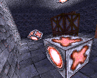
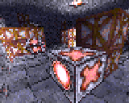
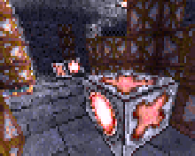
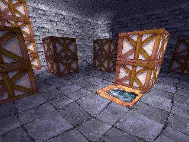
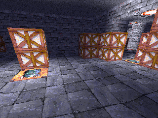
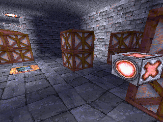

Yeti3D Old
==========

Port of the "Yeti3D Old" 3D engine demo by **Derek J. Evans** from [Nintendo Game Boy Advance](https://en.wikipedia.org/wiki/Game_Boy_Advance) (GBA) to the Motorola P2K phones platform.

## Screenshots from Motorola SLVR L6

   

## Screenshots from Motorola ROKR E1 and Motorola E770v

   

## Screenshots from Motorola RAZR V3x

  

## Photos of Motorola SLVR L6 and Motorola ROKR E1

## Videos of Motorola SLVR L6 and Motorola ROKR E1

See [Yeti3D Engine (old version) port to ELF for Motorola P2K phones](https://www.youtube.com/watch?v=qHC2QYrFZlk) video on YouTube.

## Web Demo

* [Yeti3D (old version) Web](https://lab.exlmoto.ru/y3do/) page.
* [Yeti3D (old version) Web](https://exlmotodev.github.io/y3do/) mirror page.

## Key controls

* D-Pad, 2, 4, 6, 8 - Movement.
* Left Soft Key, End Key, 0 - Quit.

## ELF files

| Phone    | Screen  | Flags | Viewport           | Fixed FPS  | FPS (avg, min-max) | ELF filename        |
|----------|---------|-------|--------------------|------------|--------------------|---------------------|
| SLVR L6i | 128x160 | ROT0  | 160x128 (original) | 30.0       | 3.18, 3.1-3.6      | Y3DO_O1_160x128.elf |
| SLVR L6i | 128x160 | ROT90 | 122x82 (zoom)      | 30.0       | 4.21, 3.9-4.6      | Y3DO_Z1_122x82.elf  |
| SLVR L6i | 128x160 | ROT90 | 96x64 (zoom)       | 30.0       | 4.49, 4.2-4.7      | Y3DO_Z1_96x64.elf   |
| SLVR L6i | 128x160 | ROT90 | 72x48 (zoom)       | 30.0       | 5.53, 4.6-6.2      | Y3DO_Z1_72x48.elf   |
| ROKR E1  | 176x220 | ROT0  | 220x176 (original) | 30.0       | 2.31, 2.1-2.7      | Y3DO_O1_220x176.elf |
| ROKR E1  | 176x220 | ROT90 | 122x82 (zoom)      | 30.0       | 4.86, 4.6-5.3      | Y3DO_Z1_122x82.elf  |
| ROKR E1  | 176x220 | ROT90 | 96x64 (zoom)       | 30.0       | 4.99, 4.8-5.9      | Y3DO_Z1_96x64.elf   |
| ROKR E1  | 176x220 | ROT90 | 72x48 (zoom)       | 30.0       | 6.14, 5.7-6.7      | Y3DO_Z1_72x48.elf   |
| E770v    | 176x220 | ROT0  | 220x176 (original) | 30.0       | ?, ?-?             | Y3DO_220x176.elf    |
| RAZR V3x | 320x240 | ROT0  | 320x240 (original) | 30.0       | ?, ?-?             | Y3DO_320x240.elf    |

### Legend

* O (1st) - Original screens resolution without any transformations.
* Z (1st) - ATI hardware zoom surface e.g. 82x122 => 176x220, 64x96 => 128x160, etc.
* 1 (2nd) - ELF for ElfPack 1.0, tested with.
* 2 (2nd) - ELF for ElfPack 2.0, tested with.

### Summary

* 5 ELFs + 5 ElfPack 2.0 ELFs + 2 ElfPack 2.0/M-CORE ELFs = 12 ELFs.

## Additional information

The ELF-application has been tested on the following phones and firmware:

* Motorola SLVR L6i: R3443H1_G_0A.65.0BR
* Motorola ROKR E1: R373_G_0E.30.49R
* Motorola E770v: R252211_U_85.9B.E1P
* Motorola RAZR V3x: R252211LD_U_85.9B.E6P (hi-res viewport bugs)

Application type: GUI + GPU.

## Useful links

* https://www.gbadev.org/demos.php?showinfo=568
