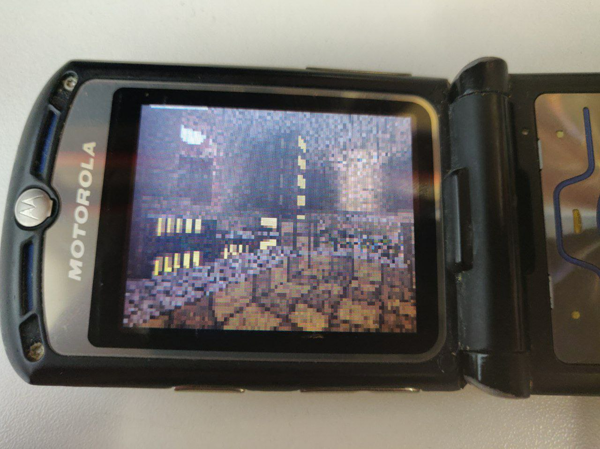
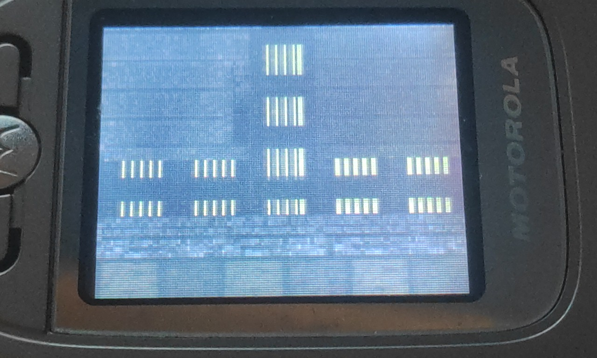
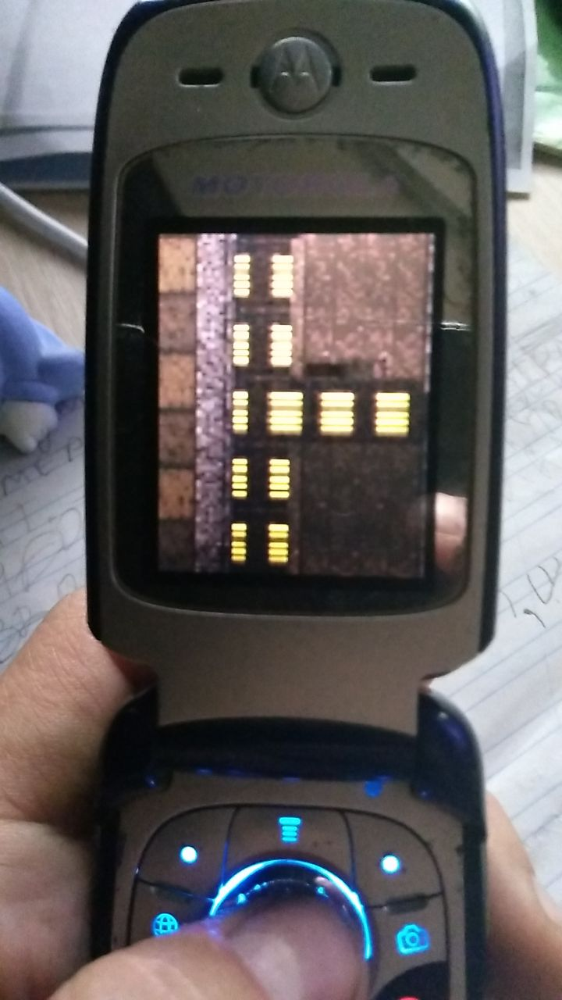

Yeti3D
======

Port of the heavy optimized "Yeti3D" 3D engine demo by **Derek J. Evans** from [Nintendo Game Boy Advance](https://en.wikipedia.org/wiki/Game_Boy_Advance) (GBA) to the Motorola P2K phones platform.

## Screenshots from Motorola SLVR L6

  

## Screenshots from Motorola ROKR E1

  

## Photos of Motorola SLVR L6 and Motorola ROKR E1

## Photos of Motorola RAZR V3i

Thanks to @Limows

 

## Photos of Motorola V235

Thanks to @Indepth6

## Photos of Motorola V360

Thanks to @baat

## Videos of Motorola SLVR L6 and Motorola ROKR E1

See [Yeti3D Engine port to ELF for Motorola P2K phones](https://www.youtube.com/watch?v=HqgMxK00QFg) video on YouTube.

## Web Demo

* [Yeti3D Web](https://lab.exlmoto.ru/y3d/) page.
* [Yeti3D Web](https://exlmotodev.github.io/y3d/) mirror page.

## Key controls

* D-Pad, 2, 4, 6, 8 - Movement.
* 1 - Look up.
* 3 - Look down.
* 7, 9 - Jump.
* Center, 5 - Fire (not available in optimized version).
* Left Soft Key, End Key, 0 - Quit.

## Other versions

* Slightly optimized version without sprites, enemy logic code and with reduced draw distance. See [yeti3d_memory_optimize](https://github.com/EXL/P2kElfs/tree/yeti3d_memory_optimize) branch in this repository.

## ELF files

| Phone   | Screen  | Flags | Viewport   Mode       | Optimized | Tasks   Semaphores | Fixed FPS  | FPS   (avg, min-max) | ELF filename         |
| ---     | ---     | ---   | ---                        | ---       | ---                     | ---        | ---                       | ---                  |
| SLVR L6 | 128x160 | ROT0  | 160x128   fullscreen  | No        | No                      | 30.0       | 5.58   5.4-5.7       | Y3D_VN1_128x160.elf  |
| SLVR L6 | 128x160 | ROT0  | 160x128   fullscreen  | Yes       | No                      | 30.0       | 5.64   5.5-5.7       | Y3D_VO1_128x160.elf  |
| SLVR L6 | 128x160 | ROT90 | 120x80   rotozoom     | No        | No                      | 30.0       | 8.20   7.8-8.5       | Y3D_RN1_120x80.elf   |
| SLVR L6 | 128x160 | ROT90 | 120x80   rotozoom     | Yes       | No                      | 30.0       | 8.23   7.8-8.6       | Y3D_RO1_120x80.elf   |
| SLVR L6 | 128x160 | ROT90 | 96x64   rotozoom      | No        | No                      | 30.0       | 10.15   9.9-10.4     | Y3D_RN1_96x64.elf    |
| SLVR L6 | 128x160 | ROT90 | 96x64   rotozoom      | Yes       | No                      | 30.0       | 10.18   9.3-10.5     | Y3D_RO1_96x64.elf    |
| ROKR E1 | 176x220 | ROT0  | 220x176   fullscreen  | No        | No                      | 30.0       | 3.74   3.4-4.0       | Y3D_VN1_176x220.elf  |
| ROKR E1 | 176x220 | ROT0  | 220x176   fullscreen  | Yes       | No                      | 30.0       | 3.91   3.7-4.0       | Y3D_VO1_176x220.elf  |
| ROKR E1 | 176x220 | ROT0  | 220x176   fullscreen  | No        | Yes                     | 1000.0     | 2.83   3.0-2.7       | Y3D_VN2T_176x220.elf |
| ROKR E1 | 176x220 | ROT0  | 220x176   fullscreen  | Yes       | Yes                     | 1000.0     | 2.83   3.0-2.8       | Y3D_VO2T_176x220.elf |
| ROKR E1 | 176x220 | ROT90 | 120x80   rotozoom     | No        | No                      | 30.0       | 8.40   7.4-8.6       | Y3D_RN1_120x80.elf   |
| ROKR E1 | 176x220 | ROT90 | 120x80   rotozoom     | Yes       | No                      | 30.0       | 8.40   7.0-8.6       | Y3D_RO1_120x80.elf   |
| ROKR E1 | 176x220 | ROT90 | 96x64   rotozoom      | No        | No                      | 30.0       | 9.90   8.5-10.1      | Y3D_RN1_96x64.elf    |
| ROKR E1 | 176x220 | ROT90 | 96x64   rotozoom      | Yes       | No                      | 30.0       | 11.15   8.6-12.0     | Y3D_RO1_96x64.elf    |
| ROKR E1 | 176x220 | ROT90 | 96x64   rotozoom      | No        | Yes                     | 1000.0     | 8.04   7.5-8.6       | Y3D_RN2T_96x64.elf   |
| ROKR E1 | 176x220 | ROT90 | 96x64   rotozoom      | Yes       | Yes                     | 1000.0     | 8.12   7.5-8.6       | Y3D_RO2T_96x64.elf   |
| V360    | 176x220 | ROT90 | 96x64   rotozoom      | No        | No                      | 30.0       | 9.98   6.2-12.1      | Y3D_RN1_96x64.elf    |
| V360    | 176x220 | ROT0  | 220x176   fullscreen  | No        | No                      | 30.0       | 3.64   2.7-5.0       | Y3D_VN1D_176x220.elf |

### Legend

* V (1st) - ATI videomode changing e.g. 176x220 => 220x176, 128x160 => 160x128, etc.
* R (1st) - ATI hardware rootation and zoom surface e.g. 120x80 => 176x220, 96x64 => 128x160, etc.
* N (2nd) - Non-optimized version with sprites and entities logic.
* O (2nd) - Optimized version with no sprites and entities logic.
* 1 (3rd) - Elf for ElfPack 1.0, tested with.
* 2 (3rd) - Elf for ElfPack 2.0, tested with.
* T (4th) - Elf for ElfPack 2.0, with using Tasks and Semaphores.
* D (4th) - Debug test version with some unique patches like screen buffer in Java Heap and FPS output, works without using `Class_dal` constant.
* J (4th) - A special optimized versions with creating screen buffer in Java Heap also, for weak phones like Motorola V600.

### Summary

* 8 ELFs + ElfPack 2.0 ELFs + 4 Task and Semaphores ELFs + 1 Debug ELF + 3 J-weak V600 ELFs = 24 ELFs.

## Additional information

The ELF-application has been tested on the following phones and firmware:

* Motorola SLVR L6: R3443H1_G_0A.65.0BR
* Motorola ROKR E1: R373_G_0E.30.49R
* Motorola V600: TRIPLETS_G_0B.09.72R
* Motorola V360: R4513_G_08.B7.ACR
* Motorola V235: R3512_G_0A.30.6CR
* Motorola SLVR L7: R4513_G_08.B7.E0R_RB
* Motorola RAZR V3i: R4441D_G_08.01.03R

Application type: GUI + ATI + Java Heap + Videomode + Tasks (in the Task version).

## Useful links

* https://web.archive.org/web/20031204145215/http://www.theteahouse.com.au:80/gba/index.html
* https://sourceforge.net/projects/yeti3dpro/
* https://forum.motofan.ru/index.php?s=&showtopic=170514&view=findpost&p=1459600
