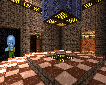

Yeti3D
======

Port of the heavy optimized "Yeti3D" 3D engine demo by **Derek J. Evans** from [Nintendo Game Boy Advance](https://en.wikipedia.org/wiki/Game_Boy_Advance) (GBA) to the Motorola P2K phones platform.

## Screenshots from Motorola SLVR L6

  

## Screenshots from Motorola ROKR E1

  

## Key controls

* D-Pad, 2, 4, 6, 8 - Movement.
* 1 - Look up.
* 3 - Look down.
* 7, 9 - Jump.
* Center, 5 - Fire (not available in optimized version).
* Left Soft Key, End Key, 0 - Quit.

## Screen resolutions and viewports

| Phone   | Screen  | Flags | Viewport            | Optimized | FPS  | ELF filename        |
| ---     | ---     | ---   | ---                 | ---       | ---  |---                  |
| SLVR L6 | 128x160 | ROT0  | 160x128 (videomode) | No        | 0.0  | Y3D_VN1_128x160.elf |
| SLVR L6 | 128x160 | ROT0  | 160x128 (videomode) | Yes       | 0.0  | Y3D_VO1_128x160.elf |
| SLVR L6 | 128x160 | ROT90 | 120x80 (rotozoom)   | No        | 0.0  | Y3D_RN1_120x80.elf  |
| SLVR L6 | 128x160 | ROT90 | 120x80 (rotozoom)   | Yes       | 0.0  | Y3D_RO1_120x80.elf  |
| SLVR L6 | 128x160 | ROT90 | 96x64 (rotozoom)    | No        | 0.0  | Y3D_RN1_96x64.elf   |
| SLVR L6 | 128x160 | ROT90 | 96x64 (rotozoom)    | Yes       | 0.0  | Y3D_RO1_96x64.elf   |
| ROKR E1 | 176x220 | ROT0  | 220x176 (videomode) | No        | 0.0  | Y3D_VN1_176x220.elf |
| ROKR E1 | 176x220 | ROT0  | 220x176 (videomode) | Yes       | 0.0  | Y3D_VN1_176x220.elf |
| ROKR E1 | 128x160 | ROT90 | 120x80 (rotozoom)   | No        | 0.0  | Y3D_RN1_120x80.elf  |
| ROKR E1 | 128x160 | ROT90 | 120x80 (rotozoom)   | Yes       | 0.0  | Y3D_RO1_120x80.elf  |
| ROKR E1 | 128x160 | ROT90 | 96x64 (rotozoom)    | No        | 0.0  | Y3D_RN1_96x64.elf   |
| ROKR E1 | 128x160 | ROT90 | 96x64 (rotozoom)    | Yes       | 0.0  | Y3D_RO1_96x64.elf   |

### Legend

* V (1st) - ATI videomode changing e.g. 176x220 => 220x176, 128x160 => 160x128, etc.
* R (1st) - ATI hardware rootation and zoom surface e.g. 120x80 => 176x220, 96x64 => 128x160, etc.
* N (2nd) - Non-optimized version with sprites and entities logic.
* O (2nd) - Optimized version with no sprites and entities logic.
* 1 (3rd) - Elf for ElfPack 1.0, tested with.
* 2 (3rd) - Elf for ElfPack 2.0, tested with.

### Summary

* 6 ELFs + ElfPack 2.0 ELFs = 12 ELFs.
* TODO: Task main loop ELFs?

## Additional information

The ELF-application has been tested on the following phones and firmware:

* Motorola SLVR L6: R3443H1_G_0A.65.0BR
* Motorola ROKR E1: R373_G_0E.30.49R

Application type: GUI + ATI + Java Heap + Videomode.

## Useful links

* https://web.archive.org/web/20031204145215/http://www.theteahouse.com.au:80/gba/index.html
* https://sourceforge.net/projects/yeti3dpro/
* https://forum.motofan.ru/index.php?s=&showtopic=170514&view=findpost&p=1459600
