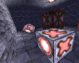
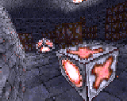
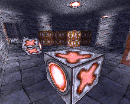
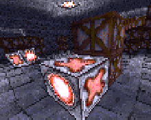
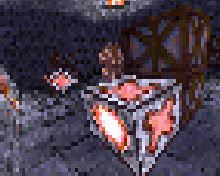

Yeti3D Old
==========

Port of the "Yeti3D Old" 3D engine demo by **Derek J. Evans** from [Nintendo Game Boy Advance](https://en.wikipedia.org/wiki/Game_Boy_Advance) (GBA) to the Motorola P2K phones platform.

## Screenshots from Motorola SLVR L6

  

## Screenshots from Motorola ROKR E1

  

## Key controls

* D-Pad, 2, 4, 6, 8 - Movement.
* Left Soft Key, End Key, 0 - Quit.

## Screen resolutions and viewports

| Phone   | Screen  | Flags | Viewport | FPS      | ELF filename           |
| ---     | ---     | ---   | ---      | ---      |---                     |
| SLVR L6 | 128x160 | ROT0  | 160x128  | Very Low | Yeti3D_EN1_176x220.elf |
| SLVR L6 | 128x160 | ROT90 | 122x82   | Very Low | Yeti3D_ES1_122x82.elf  |
| SLVR L6 | 128x160 | ROT90 | 96x64    | Low      | Yeti3D_ES1_96x64.elf   |
| SLVR L6 | 128x160 | ROT90 | 72x48    | Normal   | Yeti3D_ES1_72x48.elf   |
| ROKR E1 | 176x220 | ROT0  | 220x176  | Very Low | Yeti3D_EN1_128x160.elf |
| ROKR E1 | 176x220 | ROT90 | 122x82   | Low      | Yeti3D_ES1_122x82.elf  |
| ROKR E1 | 176x220 | ROT90 | 96x64    | Normal   | Yeti3D_ES1_96x64.elf   |
| ROKR E1 | 176x220 | ROT90 | 72x48    | Normal   | Yeti3D_ES1_72x48.elf   |

Summary: 5 ELFs + EP2 ELFs = 10 ELFs.

## Additional information

The ELF-application has been tested on the following phones and firmware:

* Motorola SLVR L6: R3443H1_G_0A.65.0BR
* Motorola ROKR E1: R373_G_0E.30.49R

Application type: GUI + ATI.

## Useful links

* https://www.gbadev.org/demos.php?showinfo=568
