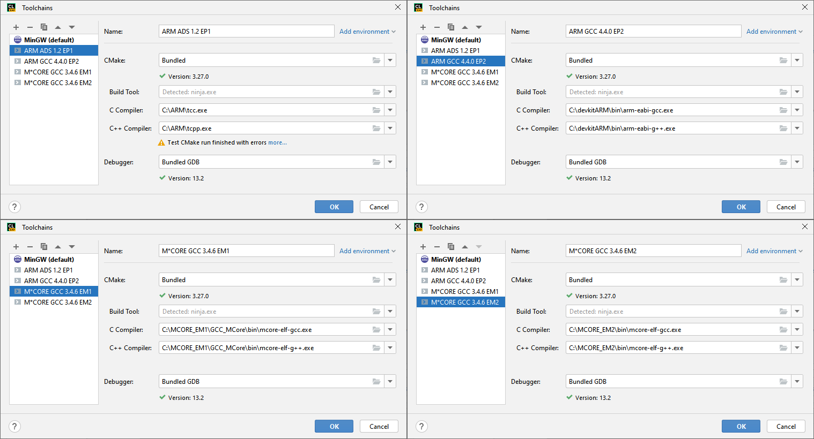
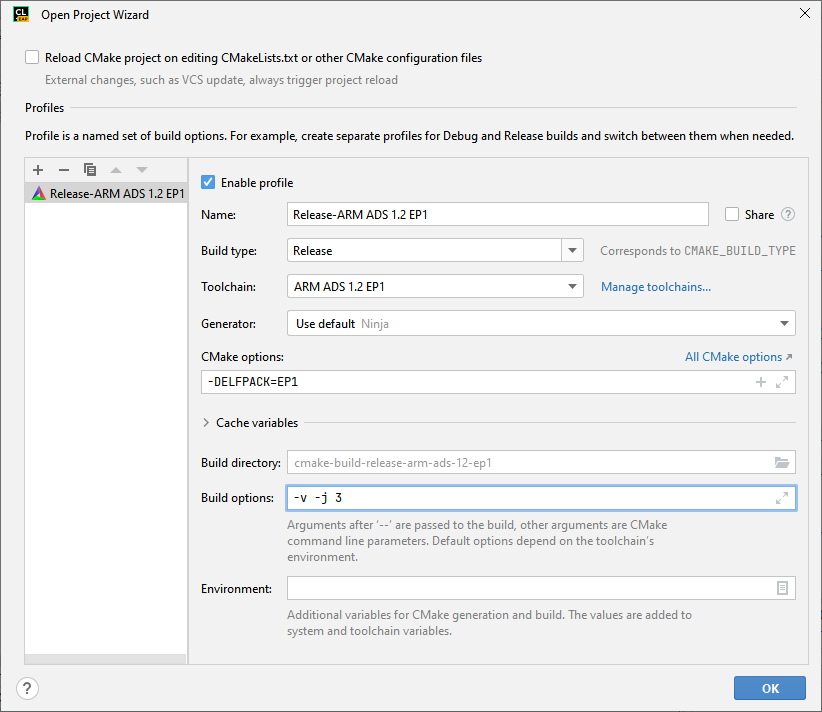
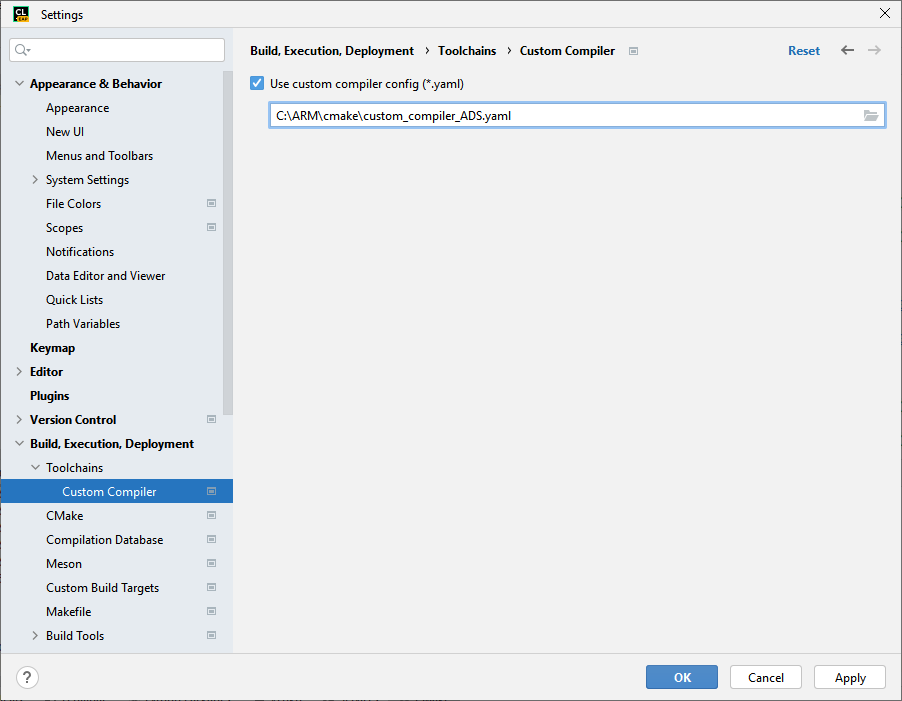

Build with CMake and CLion
==========================

Thanks to @The_g00d and @fkcoder for some help.

1. Create and configure various toolchains as in the image below. If you are using some Linux disto then only one "ARM ADS 1.2" toolchain is available on your platform which needs to be installed to the `/opt/arm` directory.

    

    File => Settings => Build, Execution, Deployment => Toolchains.

    1. [ARM ADS 1.2 ElfPack 1.x SDK for Windows](https://github.com/MotoFanRu/ELFKIT_EP1_Windows)
    2. [ARM ADS 1.2 ElfPack 1.x SDK for Linux](https://github.com/MotoFanRu/ELFKIT_EP1_Linux)
    3. [ARM GCC 4.4.0 ElfPack 2.x SDK for Windows](https://github.com/MotoFanRu/ELFKIT_EP2_Windows)
    4. [M\*CORE GCC 3.4.6 ElfPack 1.x SDK for Windows](https://github.com/MotoFanRu/ELFKIT_EM1_Windows)
    5. [M\*CORE GCC 3.4.6 ElfPack 2.x SDK for Windows](https://github.com/MotoFanRu/ELFKIT_EM2_Windows)

2. Open or create project and choose proper toolchain, then configure project as in the image below.

    

    File => Settings => Build, Execution, Deployment => CMake.

3. Add Custom Compiler scheme `custom_compiler_ADS.yaml` from `C:\ARM\cmake\` or `/opt/arm/cmake` directories.

    

    File => Settings => Build, Execution, Deployment => Toolchains => Custom Compiler.

4. Reset CMake cache and Reload project.

    Use this function every time you change the toolchain, also check/uncheck "Custome Compiler" option, it only makes sense for ADS compiler.

    Tools => CMake => Reset Cache and Reload Project.

5. Build ELF executable.

    Build => Rebuild project.
