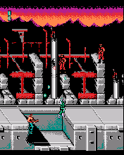

vNesC
=====

An experimental vNes emulator of Nintendo NES game console by **cbn** rewritten from J2ME Java (vNes) to C language using decompilation technique. Port from Siemens x65, x75 (SGold, NewSGold) platforms.

Place "ROM.nes" Nintendo NES/Famicom/Dendy ROM file next to the ELF application.

## Screenshots from Motorola ROKR E1 and Motorola E770v

   

## Screenshots from Motorola RAZR V3x

   

## Photos of Motorola E770v

Thanks to @diokhann

## Photos of Motorola ROKR E1 and Motorola RAZR V3x

## Videos of Motorola ROKR E1, E770v, RAZR V3x, SLVR L7e

See [TODO](TODO) video on YouTube.

## Key controls

* D-Pad, 2, 4, 6, 8 - Movement.
* 1 - Start.
* 3 - Select.
* Center, 5, 7 - A.
* 9 - B.
* 0, Left Soft, End - Exit.

## ELF files

| Phone     | Screen  | Flags     | Viewport  | Fixed FPS  | Frameskip | Platform                  | ELF filename                   |
|-----------|---------|-----------|-----------|------------|-----------|---------------------------|--------------------------------|
| ROKR E1   | 176x220 | ROT0 -O2  | 176x220   | 15.0       | 4         | EP2 (ElfPack 2.0)         | vNesC_2-15-4_176x220.elf       |
| ROKR E1   | 176x220 | ROT0 -O3  | 176x220   | 15.0       | 4         | EP2 (ElfPack 2.0)         | vNesC_2-15-4_176x220.elf       |
| SLVR L7e  | 176x220 | ROT0 -O3  | 176x220   | 15.0       | 4         | EP2 (ElfPack 2.0)         | L7e/vNesC_3-15-4_176x220.elf   |
| E770v     | 176x220 | ROT0 -O2  | 176x220   | 30.0       | 3         | EM2 (ElfPack 2.0/M-CORE)  | E770v/vNesC_2-30-3_176x220.elf |
| E770v     | 176x220 | ROT0 -O3  | 176x220   | 30.0       | 3         | EM2 (ElfPack 2.0/M-CORE)  | E770v/vNesC_2-30-3_176x220.elf |
| RAZR V3x  | 240x320 | ROT0 -O2  | 240x240   | 30.0       | 3         | EM2 (ElfPack 2.0/M-CORE)  | V3x/vNesC_2-30-3_240x240.elf   |
| RAZR V3x  | 240x320 | ROT0 -O3  | 240x240   | 30.0       | 3         | EM2 (ElfPack 2.0/M-CORE)  | V3x/vNesC_3-30-3_240x240.elf   |
| RAZR V3x  | 240x320 | ROT0 -O2  | 256x240   | 30.0       | 3         | EM2 (ElfPack 2.0/M-CORE)  | V3x/vNesC_2-30-3_256x240.elf   |
| RAZR V3x  | 240x320 | ROT0 -O3  | 256x240   | 30.0       | 3         | EM2 (ElfPack 2.0/M-CORE)  | V3x/vNesC_3-30-3_256x240.elf   |

### Legend

* 2 or 3 (1st digit) - Compiler optimization level.
* 15 or 30 (2nd digit) - Fixed FPS loop.
* 3 or 4 (3rd digit) - Frameskip option.

### Summary

* 3 ElfPack 2.0 ELFs + 6 ElfPack 2.0/M-CORE ELFs = 9 ELFs.

## Additional information

The ELF-application has been tested on the following phones and firmware:

* Motorola ROKR E1: R373_G_0E.30.49R
* Motorola ROKR E1: R373_G_0E.30.DAR
* Motorola SLVR L7e: R452D_G_08.01.0AR (memory bugs)
* Motorola E770v: R252211_U_85.9B.E1P
* Motorola RAZR V3x: R252211LD_U_85.9B.E6P

Tested ROMs:

* Chip_Dale_1.nes
* Chip_Dale_2.nes
* Contra.nes
* Guerrilla_War.nes
* Mega_Man.nes
* Super_C.nes
* Super_Mario.nes
* Battle_City.nes

Application type: GUI + GPU + Java Heap.

## Useful links

* https://cbn.narod.ru/elf_download.html
* https://cbn.narod.ru/vNES.zip
